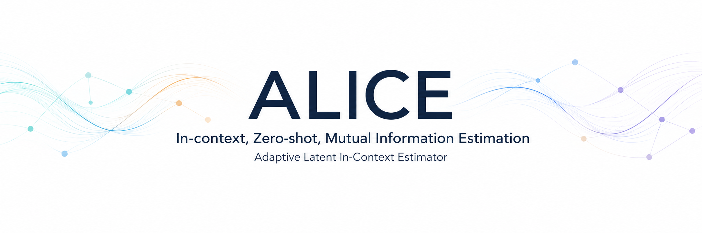

<div align="center">



<p>
  <a href="https://www.python.org/">
    
  </a>
  <a href="https://pytorch.org/">
    
  </a>
  <a href="https://huggingface.co/docs/transformers/">
    
  </a>
  <a href="https://docs.astral.sh/uv/">
    
  </a>
  <a href="LICENSE">
    
  </a>
</p>

</div>

## ✨ What is ALICE?

ALICE stands for **Adaptive Latent In-Context Estimator**.

ALICE is the first foundation model for zero-shot
mutual-information estimation. It uses a single Transformer trained once on a
broad atlas of synthetic distributions. Given context samples from
unseen distributions, ALICE estimates their mutual information!

ALICE does not require ground-truth mutual information values for inference: it only requires a few samples!

ALICE does not require any fine-tuning or training on the target distribution, making it a powerful tool for researchers and practitioners in the field of information theory, machine learning, and data science.


## 📅 Updates

- **18/09/2026** — We open the first public ALICE inference interface, so
  researchers and practitioners can start exploring the model and its zero-shot
  mutual-information estimation capabilities.

## 🚀 Quickstart

Install the package and its dependencies with
[`uv`](https://docs.astral.sh/uv/):

```bash
uv sync --locked
```

Load the official Hugging Face model
[`eurecom-probai/alice-1.0-base`](https://huggingface.co/eurecom-probai/alice-1.0-base)
or a local `save_pretrained` directory:

```python
from alice import load_model

model = load_model(
    "eurecom-probai/alice-1.0-base",
    device="cuda",  # optional; defaults to "cpu"
)
```

ALICE checkpoints load their model implementation through Hugging Face custom
code with `trust_remote_code=True`; review the checkpoint source and revision
before loading it.

Estimate mutual information in nats with the cached, batched
`alice.estimate_mi_fast`. It accepts the loaded model, a
matrix of joint samples, and disjoint column slices identifying the two
variables. The [tutorial notebook](notebooks/alice_mi_tutorial.ipynb) demonstrates
the fast estimator and its Monte Carlo standard error.

### Optimize inputs with a frozen model

Use `differentiable=True` to return a tensor and differentiate through both
context and evaluation samples. For example, with a loaded model:

```python
import torch
from alice import estimate_mi_fast

model.eval().requires_grad_(False)
device = next(model.parameters()).device
base = torch.randn(64, 2, generator=torch.Generator().manual_seed(7)).to(device)
theta, noise = base[:, :1], base[:, 1:]
design = torch.tensor(0.5, device=device, requires_grad=True)
optimizer = torch.optim.Adam([design], lr=0.01)

for _ in range(3):
    optimizer.zero_grad()
    observations = design * theta + noise
    samples = torch.cat((theta, observations), dim=1)
    mi = estimate_mi_fast(
        model,
        samples,
        slice(0, 1),
        slice(1, 2),
        n_context=32,
        n_t_samples=8,
        chunk=64,
        normalize=False,  # caller controls preprocessing
        differentiable=True,
        checkpoint_queries=True,
        generator=torch.Generator().manual_seed(42),
    )
    (-mi).backward()  # maximize the estimate
    optimizer.step()
```

`.eval()` and frozen weights remain compatible with input autograd. Calls must
run outside `no_grad()` and `inference_mode()`. Each call builds a fresh graph
and cache; query checkpointing trades backward recomputation for activation
memory. See [input-autograd guidance](docs/input-autograd.md) for cache support,
smooth normalization, precision limits and benchmarks. Ordinary
calls retain their Python-float results and inference behavior. With
`normalize=True`, differentiable calls use a smooth context-fitted Gaussian CDF;
ordinary inference uses hard empirical ranks. These transforms can give different
MI values. `normalize=False` bypasses normalization in both modes.

## Citation


```bibtex
@misc{franzese2026,
      title={ALICE: In-context, Zero-shot, Mutual Information Estimation}, 
      author={Giulio Franzese and Simone Rossi and Pietro Michiardi},
      year={2026},
      eprint={2609.34962},
      url={https://arxiv.org/abs/2609.34962}, 
}
```

## License

This project is licensed under the [PolyForm Noncommercial License 1.0.0](LICENSE).
It permits use, modification, and redistribution for noncommercial purposes,
subject to the terms in the license. The license includes a patent license from
the licensor.

## Development

```bash
uv sync --locked --group dev
uv run pytest
uv build
```

<div align="center">
  <sub>✨ Research-ready inference for context-aware denoising and mutual-information estimation. ✨</sub>
</div>
